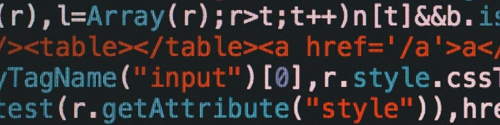

<h1 align="center"> 
  Hola, <a href="https://www.linkedin.com/in/franco-adolfo-bottaro/">Soy Franco Bottaro 🧑🏻‍💻</a>
</h1>

## Sobre mi:
Full-Stack con tendencia al Back-End, en constante aprendizaje y de caracter Pro-Activo y Re-Activo. Curioso de naturaleza, con cierto gusto a temas muy sociales diversos sin llegar a profundizar.

## Habilidades tecnicas: 
### Conocimientos:
Back-End: Protocolos HTTP, NodeJs, Express, NestJS, Web-Socket

Data-Base: SQL, PostgreSQL, Sequelize, Prisma

Front-End: React, React-Router-DOM, Redux, ReduxToolkit, React-Redux

Complementarias: HTML, CSS, JavaScript, TypeScript, Fetch,  Axios, Git, GitHub, GitFlow, MarkDown
 

## Contacto:
- LinkedIn: [Franco Adolfo Bottaro](https://www.linkedin.com/in/franco-adolfo-bottaro)  
- Email: **_francoabottaro@gmail.com_**

## Post-Data:
Gracias por leer mi README  
[Buenos dias, buenas tardes y buenas noches](https://www.youtube.com/watch?v=QlqKsMxH9pY).
