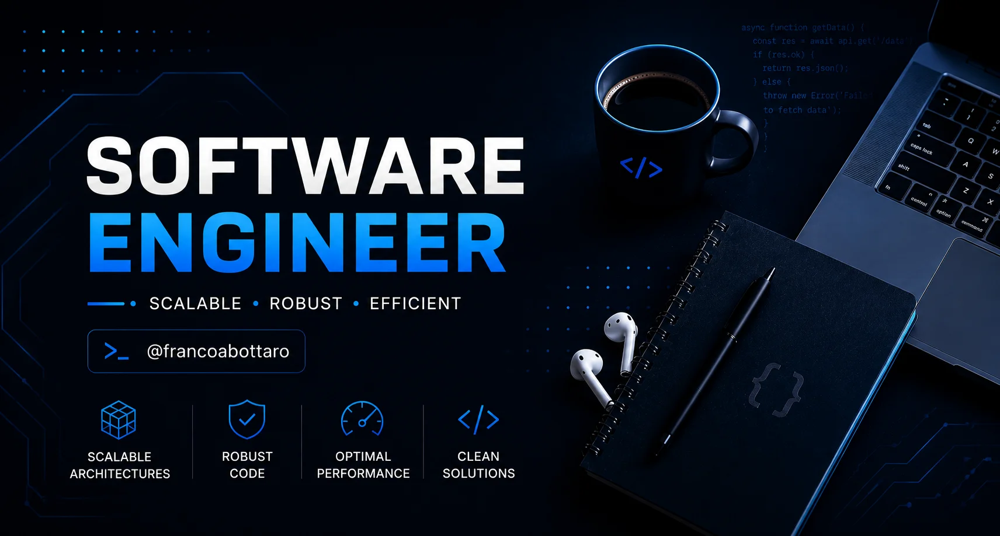

<h1 align="center"> 
  Hola, soy Franco Bottaro 
  
</h1>

  

---
## Sobre mí 🧑🏻

Franco Bottaro, de Argentina .

Desarrollador Full Stack apasionado por construir productos digitales robustos y escalables. Mi enfoque principal reside en el Backend, donde me especializo en diseñar arquitecturas modulares, APIs seguras utilizando TypeScript como lenguaje principal y Go para tareas de alto rendimiento.

---

## Tecnologías principales 🚀

  
| Categoría | Tecnologías |
|-----------|-------------|
| **Lenguajes** |    |
| **Backend** |   |
| **Frontend** |     |
| **Bases de datos** |    |
| **ORM/ODM** |    |
| **Runtime & Package Managers** |     |
| **Herramientas** |      |

---
## Contacto 📬

- **LinkedIn:**  
  <a href="https://www.linkedin.com/in/francoabottaro/" target="_blank">Franco Bottaro | LinkedIn</a>

- **Email:**  
  _francoabottaro@gmail.com_

---

## 🔗 Perfil de GitHub  
https://github.com/francoabottaro
